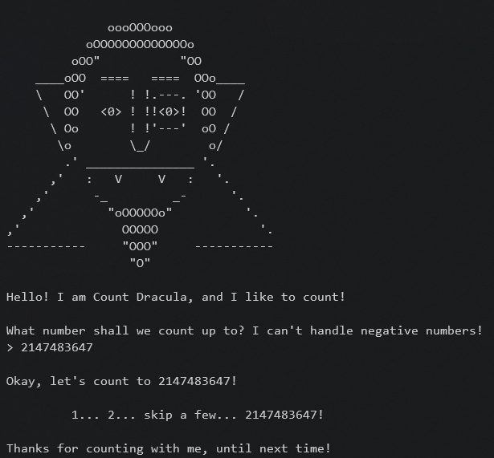
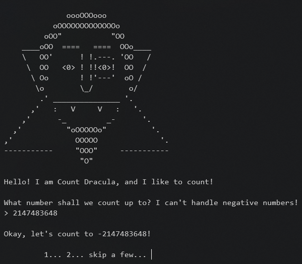
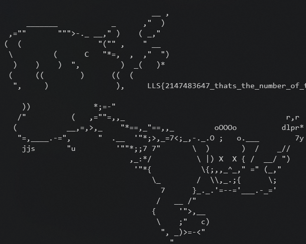

# Count Dracula

* First submit 2147483647 value, which is max value for integer that C++ can support.   

* Now if we submit 2147483647 + 1 =  `2147483648` ...   
       
       

    > ###  LLS{2147483647_thats_the_number_of_the_day}