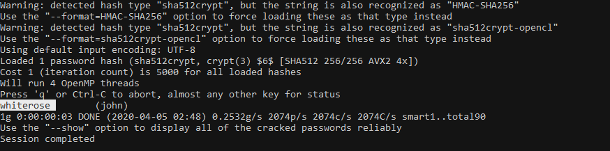

# I Lost my Password!

* We have two files `passwd` and `shadow`. In linux, passwd file contains list of users and the shadow file contains encrypted passwords. https://www.cyberciti.biz/faq/understanding-etcshadow-file/

* We can use John the Ripper with the rockyou wordlist to get password.
    * `unshadow passwd shadow > a.john`
    * `john a.john --wordlist=/path/to/rockyou.txt`

    

> ### LLS{whiterose}