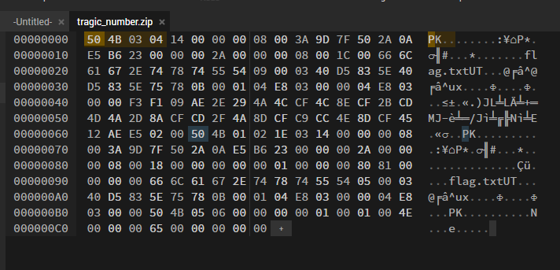

# Tragic Number

* After downloading the zip file, I have tried to extract it. But it gave error! Then I have checked its format by `file` command. It wasn't zip. 

* I am using online hex editor [https://hexed.it/] to view/edit the file. 

* Here is the list of different file formats and their signatures. [https://en.wikipedia.org/wiki/List_of_file_signatures]
    

* From that wikipedia page, the zip file's signature is `50 4B 03 04` But here the the file starts with `48 34 43 4B`, So replace that with actual signature.
    

* And export the file, and extract it.

    > ### LLS{tragic_number_more_like_magic_number}
