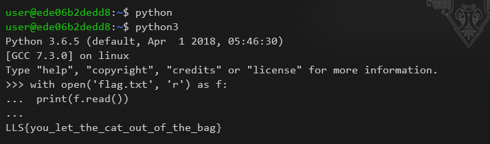

# Catalias

* after running `ls` command, found that there is flag.txt in the directory but...
* cat, more, less commands won't work 😨
* If there is python installed, I can write script to read the file!
    ```python
    with open('flag.txt') as f:
        print(f.read())
    ```

    

>  ### LLS{you_let_the_cat_out_of_the_bag}