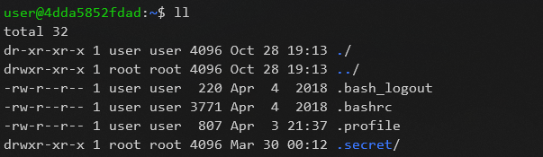
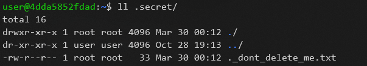

# Hidden
* Run `ll` to list all directories
    

* there is a directory `.secret`
    

* which contains `._dont_delete_me.txt` file
* run `cat ._dont_delete_me.txt` get the flag
    

> ### LLS{you_found_my_hidden_secrets}
