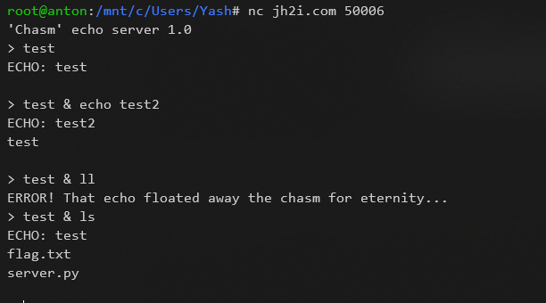
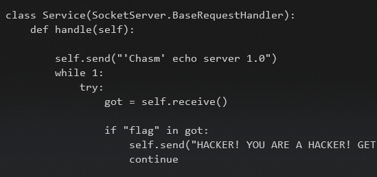
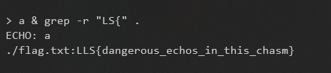

# Chasm

* Looks like we can inject any command and get output!
* After running `a & ls` command, I found that there is `flag.txt` file in that directory.
    

* Then I tried reading `flag.txt` but it gave error. Because the `server.py` contains one condition, if command contains `flag` then don't execute it.  
    

* But we know the flag's format. So we can use grep on this directory to get the flag!
    > `a & grep -r "LS{" .`
    
    
<!-- 
    * Output  
    ```
    ECHO: a  
    ./flag.txt:LLS{dangerous_echos_in_this_chasm}
    ``` -->
    
> ### LLS{dangerous_echos_in_this_chasm}