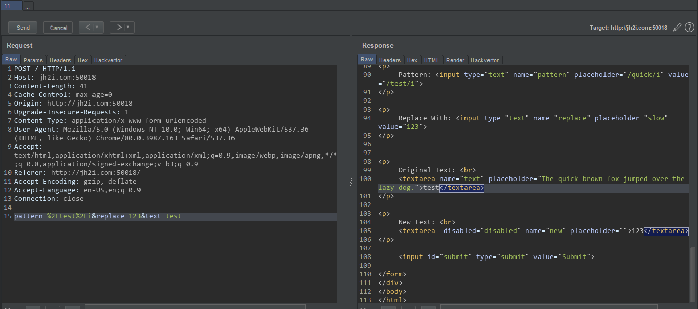
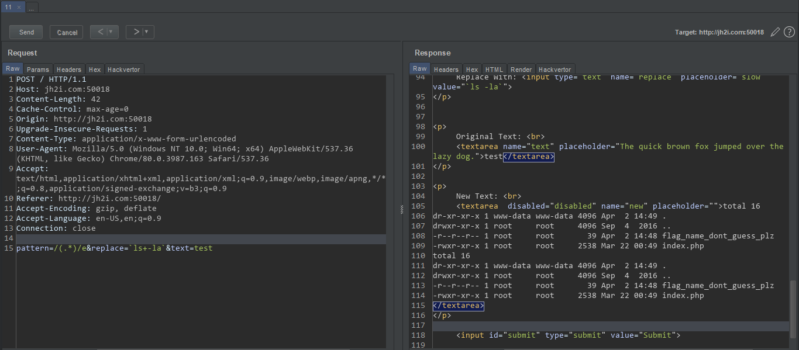
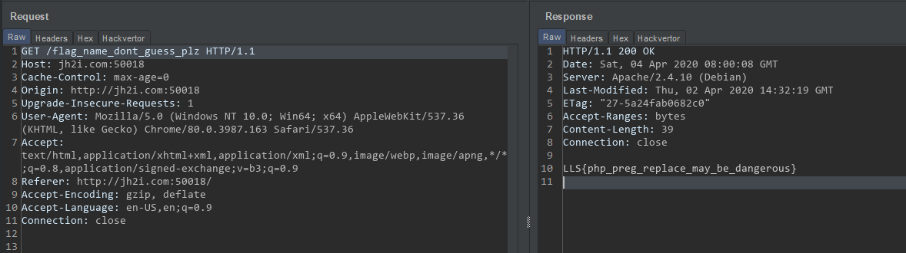

# Irregular Expression

This page contains form, we can send regex, text and string to replace. This replace function will be processed by backend `php`. and I remembered one CTF writeup, in which PHP's `preg_match` function was vulnerable to Remote Code Execution.

So in the regex, if we use `/e` modifier and the shell command we can get RCE!

So I submitted
* pattern = /(.*)/e
* replace = \`ls+-la\` 
* text = test

And found that that file contains the flag

> ### LLS{php_preg_replace_may_be_dangerous}
