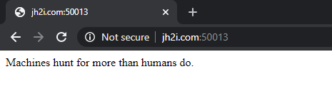
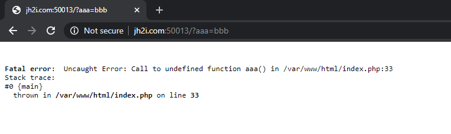
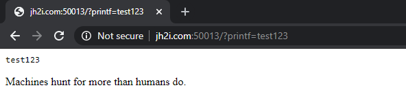
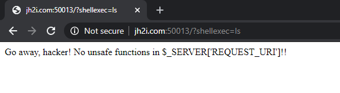
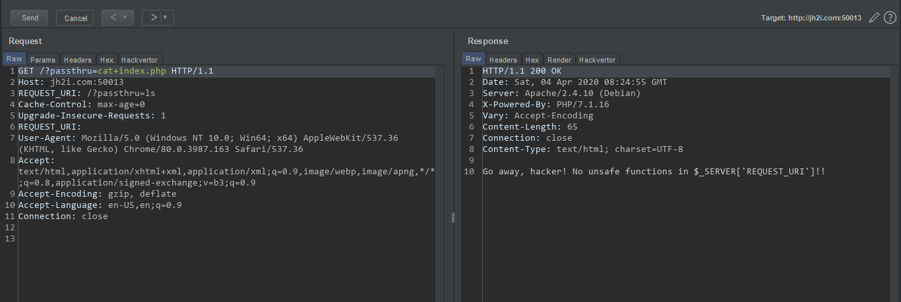
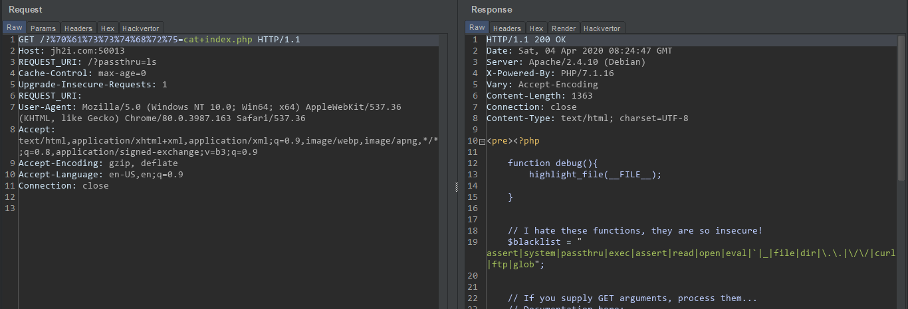
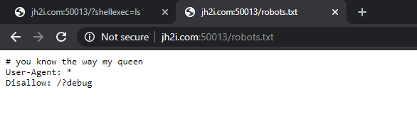
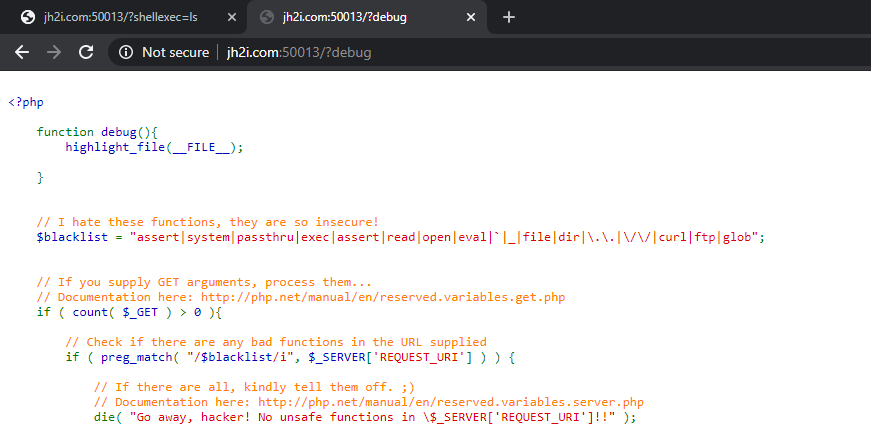
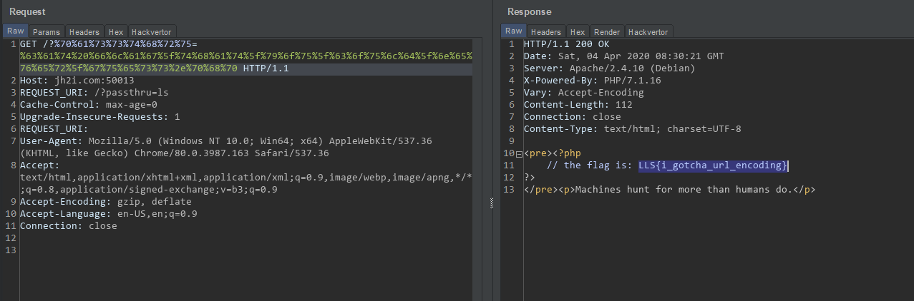

# GET Encoded

We have this website that says `Machine hunts for more than humand do`, Nothing else. But the challenge's name is GET Encode, there must be something to do with the query parameters. 

So I sent request to `/?aaa=bbb` and in the response I got error message that function `aaa` was undefined.

So then I tried printf function to check does it takes function arguments? So I sent the request `/?printf=test123` and it worked.

Then I tried using the `shellexec` function to execute code but it gave this error. After spending about 20 minutes on REQUEST_URI header, I could not find anything. I have also tried other functions like exec, passthru... file nothing workked. 

Then after URL encoding the parameter's name, I sent the request. So,
*  >  `/?passthru=cat+index.php`   

After URL ecoding

* > `/?%70%61%73%73%74%68%72%75=cat+index.php`

And it worked. I can execute any command like this so after executing `ls` command I found these files. There was robots.txt file too that I did not notice before! 

After opening the robots.txt file I foudn that we can use `/?debug` query to get PHP source code!

Anyway, I used `cat` command to read the flag.php file. But it did not allow dots, so I had to URL encode the value as well.

> ### LLS{i_gotcha_url_encoding}

