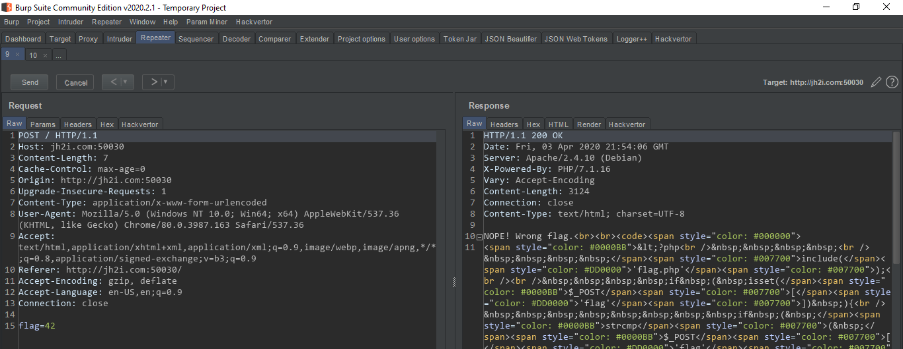
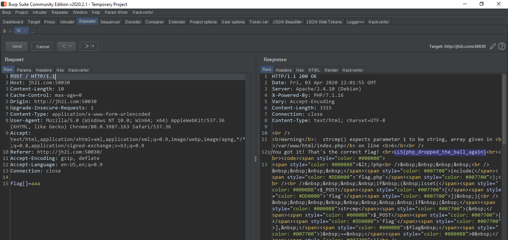

# PHPJuggler

> PHP is here to entertain again! They’ve shown you magic tricks, disappearing acts, and now… juggling!

This was the code of the PHP file
```php
<?php
    
    include('flag.php');

    if ( isset($_POST['flag']) ){
        if ( strcmp( $_POST['flag'], $flag ) == 0 ){
            echo("You got it! That's the correct flag! <br>");
            echo($flag);
        }else{
            echo("NOPE! Wrong flag.");
        }
        echo ("<br><br>");
    }

    highlight_file(__FILE__);   
?>

<html>
<head> <title> PHP Juggler </title> </head>
    <body>
    <br><br>
    <form action="#" method="POST">
        <p> Tell me the flag. </p>
        <input type="text" name="flag">
        <input type="submit" value="Submit">
    </form>
</html>
```

I submitted some random flags. I was reading The
Hitchhiker's Guide to the Galaxy, So I have tried submittig the value "42" but it didn't work!


Then I read the code again, and saw `strcmp`!
So instead of `flag=anything` if we pass `flag[]=anything`, the flag will become array. And in strcmp function it will return `NULL` and `NULL == 0` will be `true` so we will get the flag!


> #### LLS{php_dropped_the_ball_again}

