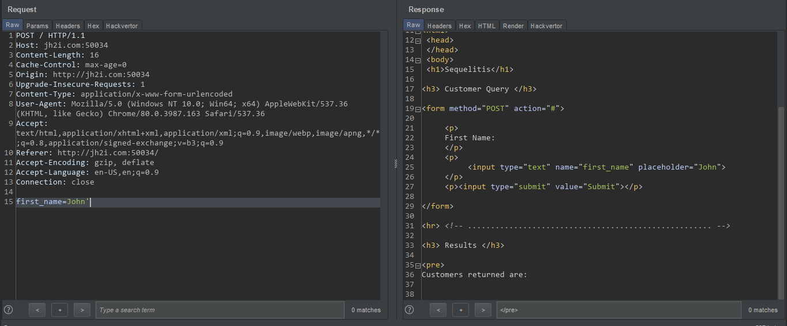
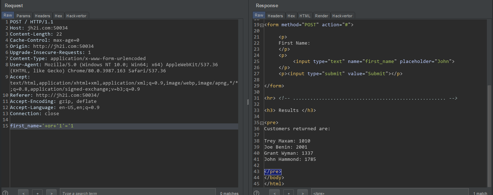
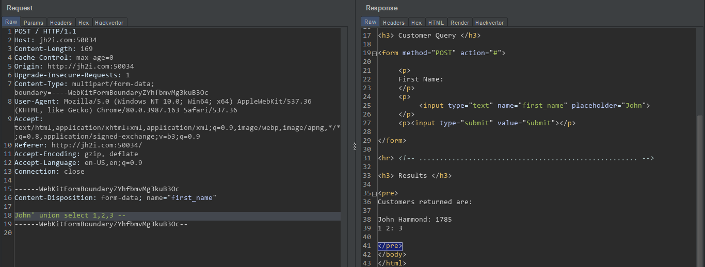
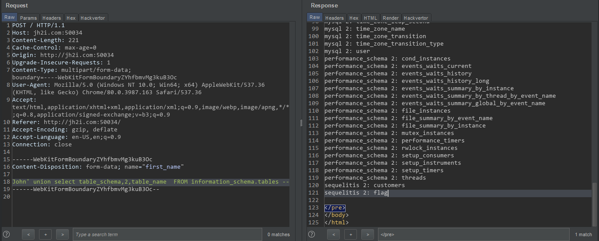
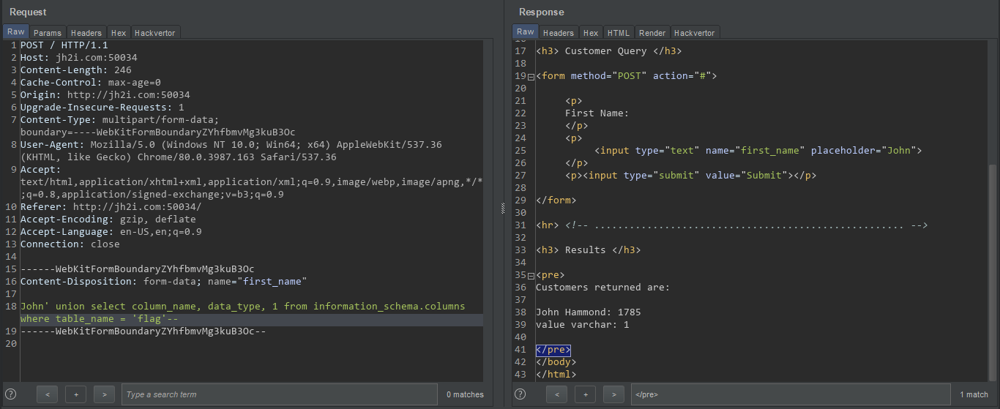
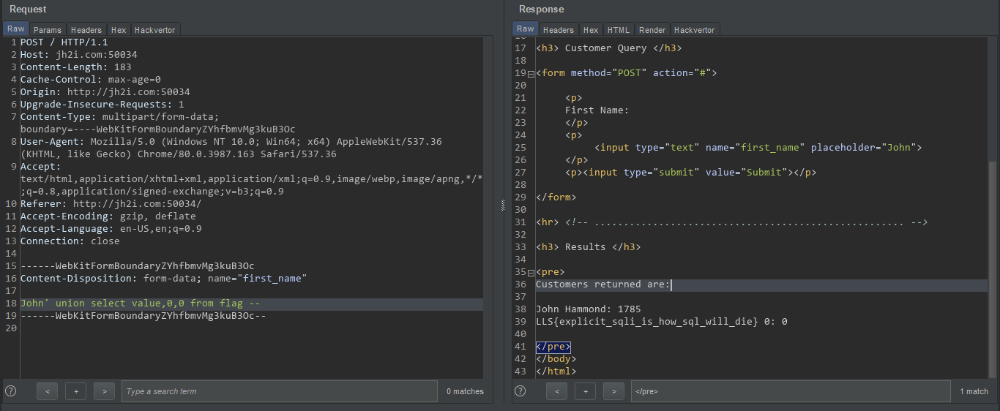

# Sequelitis

This challenge was really easy. There was one form, by submitting it, the page displayed search results.  
To check SQLi, I submitted single quote at the end of query.
And because of error, the content after the search result block did not render. 

So I have used `' OR '1'='1` payload to get list of all users. But there was no flag.

So I tried retriving all the tables in the database. We need to know number of columns in the current query so that we can use union based attacks. By using `' union select 1,2,3 -- `, I found that first and second columns were of firsr and last name, the 3rd column was of ID.

I have used `John' union select table_schema,2,table_name  FROM information_schema.tables -- ` to get all tables. There was one table named flag.

But now we still need the colums of `flag` table. To get columns,
* `John' union select column_name, data_type, 1 from information_schema.columns WHERE table_name = 'flag'-- `

Now that we know table and it's column names, we can use...
* `John' union select value,0,0 from flag -- `

> ### LLS{explicit_sqli_is_how_sql_will_die}

